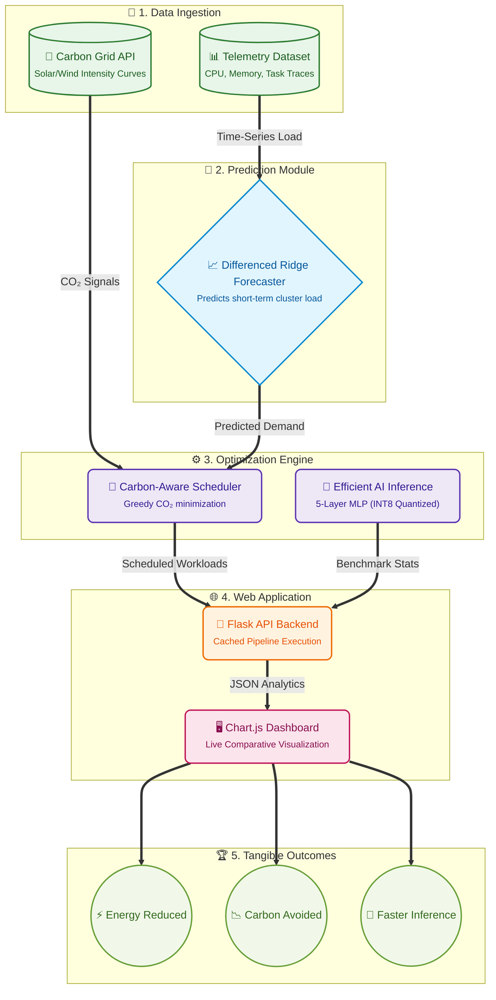

# Green AI for Sustainable Cloud Computing

## Team

| Name                        | Role        |
| --------------------------- | ----------- |
| **Gargi Joshi**             | Team Leader |
| **Ayman Nisar Kazi**        | Team Member |
| **Hemanshu Vikas Ganekar**  | Team Member |
| **Rajvardhani Amol Pawar**  | Team Member |
| **Anmay Vinod Chavan**      | Team Member |
| **Kamble Pranjali Kalidas** | Team Member |

---

## How to Start the Application

### 1. Clone the Repository

```powershell
git clone <repository-url>
cd <project-folder>
```

### 2. Set Up the Dataset

Download the Green AI workload dataset:

[Green AI Dataset ZIP](https://drive.google.com/file/d/1ekXGp0rh72kzT95Vs6NqHTP1eoi99nB4/view?usp=sharing)

Extract the downloaded ZIP and place the extracted files inside:

```text
dataset/raw/
```

The project should have a structure similar to:

```text
Green-AI/
├── dataset/
│   └── raw/
│       ├── dataset files...
│
├── prediction/
├── scheduler/
├── inference/
├── dashboard/
├── requirements.txt
└── README.md
```

> **Note:** `dataset/raw/` is excluded from Git because the dataset contains large files.

### 3. Create a Python Virtual Environment

From the project root:

```powershell
python -m venv .venv
```

Activate it on Windows:

```powershell
.venv\Scripts\activate
```

If PowerShell blocks script execution, run:

```powershell
Set-ExecutionPolicy -ExecutionPolicy RemoteSigned -Scope CurrentUser
```

Then activate the environment again:

```powershell
.venv\Scripts\activate
```

### 4. Install Dependencies

```powershell
python -m pip install --upgrade pip
python -m pip install -r requirements.txt
```

### 5. Run the Dashboard

Start the Flask backend from the project root:

```powershell
python dashboard/app.py
```

You should see Flask start on port `5000`.

Open your browser and visit:

```text
http://localhost:5000
```

### 6. Available API Endpoints

The Flask backend provides the following endpoints:

| Endpoint                      | Purpose                                          |
| ----------------------------- | ------------------------------------------------ |
| `/api/health`                 | Checks whether the backend is running            |
| `/api/dashboard`              | Returns dashboard data and overall results       |
| `/api/inference-metrics`      | Returns FP32 vs INT8 inference benchmark results |
| `/api/sustainability-metrics` | Returns energy and carbon-reduction metrics      |

For example:

```text
http://localhost:5000/api/health
```


### 7. Application Workflow

Once the application is running, the pipeline works as follows:

```text
Cloud Workload Dataset
        ↓
Data Preprocessing
        ↓
Workload Prediction
        ↓
Carbon-Aware Scheduler
        ↓
Baseline vs Green AI Simulation
        ↓
Efficient Inference Benchmark
        ↓
Flask API
        ↓
Dashboard
        ↓
Energy & Carbon Metrics
```

The dashboard compares:

* **Baseline:** Immediate execution + FP32 inference + no carbon awareness
* **Green AI Pipeline:** Workload prediction + carbon-aware scheduling + INT8 inference

### 8. First Run

The first dashboard request may take a few seconds because the application performs the required model processing and inference benchmarking.

Results are cached for the running Flask process, so subsequent dashboard requests should be faster.

### 9. Verify the Application

After starting the server, first check:

```text
http://localhost:5000/api/health
```

If the backend is working, then open:

```text
http://localhost:5000
```

The dashboard should display the workload analysis, scheduling results, inference benchmarks, and sustainability metrics.

---

## Expected Outcome

The completed prototype runs simulated workloads in two scenarios:

1. **Baseline execution**
2. **Green AI optimized execution**

It then compares the two scenarios to quantify:

* ⚡ Energy consumption
* 🌱 Carbon emissions
* 📊 Workload shifted to lower-carbon periods
* 🤖 FP32 vs INT8 inference performance
* 📉 Overall percentage reduction in energy and carbon emissions

## System Architecture



The goal is to demonstrate how **AI-based workload prediction, carbon-aware scheduling, and efficient model inference can work together as a unified sustainable cloud-computing pipeline.**
