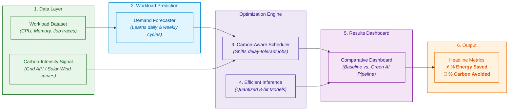

# Green AI for Sustainable Cloud Computing

## The Problem

Cloud data centers run computing jobs the moment they're submitted, regardless of how the electricity powering them is generated at that moment. Whether the grid is running on solar and wind or on coal and gas, jobs execute immediately. This means a huge amount of avoidable carbon emissions comes not from *how much* computing we do, but from *when* and *how* we do it.

Data centers are one of the fastest-growing sources of global electricity demand, and most of that demand is not scheduled with any awareness of the environmental cost behind it.

## The Solution

This project builds a working prototype of a **smarter cloud system** — one that reduces energy consumption and carbon footprint using AI, without requiring new hardware or slowing down critical work.

It does this through three combined techniques:
1. **Workload Prediction** (forecasting demand)
2. **Carbon-Aware Scheduling** (shifting flexible jobs to green windows)
3. **Energy-Efficient Inference** (quantizing models for lower computational cost)

---

## System Architecture



---

## Detailed Explanation of Each Component

### 1. Data Layer
This is the foundation everything else depends on. It consists of two separate data streams:
- **Workload dataset** — Historical records of computing demand over time (e.g., CPU utilization, number of jobs submitted, memory usage) sampled at regular intervals (hourly/minutely). Sourced from public cloud traces like the Google Cluster Trace or Azure Public Dataset.
- **Carbon-intensity signal** — A metric representing how carbon-heavy the electricity grid is at any given moment. Sourced from real-time grid APIs (WattTime, Electricity Maps) or simulated using realistic diurnal patterns (e.g., cleaner during midday solar peak, dirtier at night).

*Role:* Clean, prepare, and feed structured data to downstream components.

### 2. Workload Prediction
This module analyzes historical workload data to forecast demand in the near future (e.g., the next 1–6 hours) by learning daily cycles, weekly variations, and long-term trends.
- **Output:** Numeric forecast (e.g., *"expect approximately $X$ workload at hour $T+1$, $Y$ at $T+2$"*).
- **Role:** Supplies the predictive horizon required by the scheduler to make proactive load-shifting decisions.

### 3. Carbon-Aware Scheduler
Consumes both the workload forecast and current/projected carbon intensity to apply dynamic scheduling policies:
- **Decision Rule:** If a job is delay-tolerant and current grid carbon intensity is high, the job is deferred to cleaner time windows. Urgent jobs and jobs during low-carbon periods execute immediately.
- **Role:** Shifts flexible compute tasks to minimize emissions without violating operational deadlines.

### 4. Efficient Inference
Focuses on *how* computations are executed (orthogonal to *when* they run):
- Applies model optimization techniques such as **quantization** (e.g., converting FP32 weights to INT8), shrinking model size and accelerating inference with minimal accuracy impact.
- Measures and benchmarks baseline versus quantized models in terms of latency and energy consumption.

### 5. Results Dashboard
Aggregates and visualizes performance data from the entire pipeline:
- Ingests scheduling logs (job deferrals, shifted compute, avoided emissions) and inference metrics (quantization energy savings).
- Renders side-by-side comparative views of the baseline vs. optimized system.

### 6. Output
Synthesizes the overall impact into key evaluation metrics:
- **% Reduction in Total Energy Consumed**
- **% Reduction in Total Carbon Emitted ($\text{CO}_2\text{e}$)**
- Benchmarked against a naive baseline (immediate execution, full-precision models, zero carbon awareness).

---

## What's Novel Here vs. Existing Research

This project builds on well-established foundations:
- **ML-based workload forecasting** — Established time-series forecasting literature.
- **Carbon-aware job scheduling** — Production principles (e.g., Google carbon-intelligent computing).
- **Model quantization & efficient inference** — Standard ML efficiency optimization.

**Key Contribution:** Integrating all three techniques into a unified, end-to-end prototype pipeline to quantify and evaluate their **combined** energy and carbon reduction impact.

---

## Project Structure

```
├── dataset/        → Cloud trace datasets and carbon intensity signals
│   └── raw/        → Raw data files (git-ignored)
├── prediction/     → Workload forecasting models and training pipelines
├── scheduler/      → Carbon-aware scheduling logic and simulation
├── inference/      → Model quantization and energy benchmark scripts
├── dashboard/      → Visualization of metrics and comparison results
├── requirements.txt→ Project dependencies
└── README.md       → Project overview and architecture documentation
```

---

## Dataset

The workload dataset used in this project is provided as a ZIP file on Google Drive.

**Download:** [Green AI Dataset ZIP](https://drive.google.com/file/d/1ekXGp0rh72kzT95Vs6NqHTP1eoi99nB4/view?usp=sharing&utm_source=chatgpt.com)

### Setup

1. Download the ZIP file from the link above.
2. Extract the ZIP.
3. Place the extracted files inside:

```text
dataset/raw/
```

The structure should look like:

```text
dataset/
└── raw/
    ├── dataset files...
```

The `dataset/raw/` folder is excluded from GitHub because the dataset may contain large files.

### Usage

The dataset is used to:

* Analyze historical cloud workload.
* Train the workload prediction model.
* Generate workload forecasts.
* Provide workload information to the carbon-aware scheduler.
* Compare baseline and Green AI scheduling performance.

After placing the dataset in `dataset/raw/`, run the preprocessing pipeline before training the prediction model.

## Expected Outcome

A working end-to-end prototype running simulated workloads twice — first as an unoptimized baseline, and second through the Green AI pipeline — demonstrating measurable reductions in energy usage and carbon emissions.
